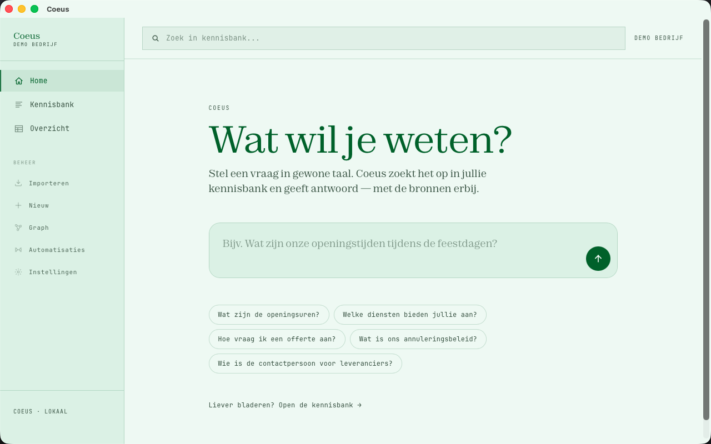

# Coeus

**A local-first, white-label AI knowledge base — shipped as an installable desktop app.**

Point Coeus at your business's information — paste text, ingest a URL, crawl a whole
website, or drop in PDFs — and ask questions in plain language. It answers grounded in
*your* data, **with sources**. Everything runs on the user's own machine: offline, no
accounts, no data leaving the device. The cloud LLM is optional and only used for
answering/extraction when a key is configured.

A product of **Ynarchive**. This is the product monorepo (backend + desktop app, one installer).



---

## Why it's interesting (engineering)

- A **Tauri (Rust) desktop shell bundles a Python AI backend as a sidecar** and supervises its lifecycle on a loopback port.
- A **static Next.js SPA** (no server, no auth) talks to that backend client-side, served over Tauri's asset protocol.
- **Multilingual semantic retrieval runs fully offline via ONNX** (`fastembed`) — **no PyTorch** in the bundle, so the installer stays lean (~220 MB model vs ~1 GB with torch).
- **LLM is optional and key-configurable per install** — the key lives locally, never in the shipped bundle.
- **Signed auto-updates** via GitHub Releases, **prompt-injection-hardened**, strict CSP, and a **CI-gated** pipeline.

## What it does

- **Ask your knowledge base** — natural-language RAG Q&A grounded in your own data, with **cited sources**. (DeepSeek: a fast model for answering, a stronger one for extraction.)
- **Onboard in minutes** — paste text, ingest a single URL, **crawl an entire site**, or upload **PDF / Markdown / TXT**. An LLM structures messy real-world pages into clean, categorized knowledge instead of raw noise.
- **Multilingual semantic search** — `paraphrase-multilingual-MiniLM` via ONNX, strong on Dutch, runs offline.
- **Knowledge graph**, a sortable overview with **CSV / PDF export**, and manual create/edit.
- **Local auto-backup**, **auto-cleanup** (near-duplicate dedupe via embeddings), and **signed auto-update**.
- **White-label** — per-client theming + seed data at build time.

## Architecture

| Layer | Tech | Notes |
|---|---|---|
| **Desktop shell** | Tauri 2 (Rust) | Bundles + launches the brein sidecar; signed auto-updates; strict CSP; kills the child on exit. |
| **UI** | Next.js 16 · React 19 · Tailwind 4 | `output: export` static SPA — no server, no auth gate; client-side fetch to the local brein. |
| **Brein (backend)** | Python 3.12 · FastAPI · ChromaDB | Key-free CRUD / search / graph / ingest; optional LLM for `/learn` + `/ask`. Loopback only. |
| **Embeddings** | `fastembed` (ONNX runtime) | Multilingual, offline, no torch. Bundled into the app for offline use. |
| **CI/CD** | GitHub Actions | Gated PRs (types, lint, static build, `cargo check`, backend import) + dependency/secret scanning + signed multi-platform release builds. |

**Security:** prompt-injection hardening (LLM context wrapped in delimiters + a system
instruction that delimited content is data, never instructions, + JSON-mode extraction),
a strict Content-Security-Policy, loopback-only backend, and the LLM key stored locally
in the data dir — never in the JS bundle or the binary.

## Repo layout

| Path | What |
|---|---|
| **`/` (root)** | The **brein** — Python FastAPI + ChromaDB backend. Runs as an offline sidecar. |
| **`desktop/`** | The **desktop app** — static Next.js UI + the Tauri (Rust) shell that bundles and launches the brein. See [`desktop/README.md`](desktop/README.md). |

## Run the backend locally

Requires **Python 3.12** (type annotations use `X | None`).

```bash
python3.12 -m venv venv && source venv/bin/activate
pip install -r requirements.txt

cp .env.example .env            # optional: add a DeepSeek/OpenAI key for /learn + /ask
uvicorn main:app --reload       # http://127.0.0.1:8000  ·  docs at /docs
```

The knowledge endpoints (`/kennis*`, `/kennis/search`, `/categories`, `/graph`,
`/ingest/*`) work **without any API key**. `/learn` and `/ask` need a key (DeepSeek by
default, OpenAI-compatible). The multilingual embedding model downloads once on first use
and is cached for offline runs.

### API (selected)

| Method | Path | Description |
|---|---|---|
| `GET` | `/kennis/search?q=` | Offline semantic search |
| `POST` | `/learn` | LLM extracts structured knowledge from free text |
| `POST` | `/ask` | RAG answer grounded in the knowledge base, with sources |
| `POST` | `/ingest/url` · `/ingest/crawl` · `/ingest/file` | Onboard a page, a whole site, or a PDF/MD/TXT |
| `GET` | `/graph` | Knowledge graph (nodes + relations) |

## Build the desktop app

```bash
python build_sidecar.py                  # build + bundle the offline brein sidecar
cd desktop && npm install && npm run desktop:build
```

See [`desktop/README.md`](desktop/README.md) for the per-client (white-label) build flow.

---

*Coeus — named after the Titan of intellect. Built by [Ynarchive](https://github.com/20YN04), a one-person design + full-stack studio.*
